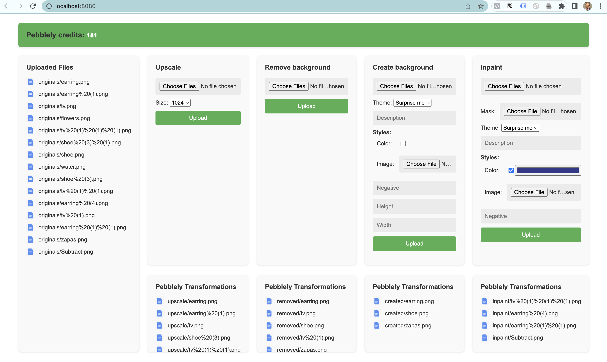

# Pebblely UI

Pebblely UI is a web-based user interface for the Pebblely application, which provides various image transformations and enhancements. This UI allows users to upload images, apply different transformations, and view the resulting images.

## Features

- **Uploaded Files**: Displays a list of uploaded files.
- **Upscale**: Allows users to upscale images by selecting files and choosing the desired size.
- **Remove Background**: Enables users to remove the background from images by selecting files.
- **Create Background**: Allows users to create a custom background by selecting files, choosing a theme, and specifying additional options like color, negative, height, and width.
- **Inpaint**: Allows users to inpaint images by selecting files, providing a mask, and choosing a theme. Additional options like color, negative, and description can also be specified.

## API Documentation

For the API documentation and available endpoints, refer to the [Pebblely API Documentation](https://pebblely.com/docs/#endpoints).

## Technologies Used

- Thymeleaf: Server-side Java template engine for rendering dynamic HTML pages.
- HTML/CSS: Markup language and stylesheets for structuring and styling the UI.
- JavaScript: Client-side scripting language for interactive functionality.
- Spring Boot: Java framework for building web applications.
- Java: Programming language used for server-side logic.
- File Upload: Handling file uploads using `enctype="multipart/form-data"` and server-side processing.
- Responsive Design: The UI is designed to adapt to different screen sizes and devices.

## Setup and Installation

1. Clone the repository: `git clone <repository-url>`
2. Install dependencies: `mvn clean install`
3. Configure pebblely api key: `-Dpebblely.api-key=REPLACE_WITH_API_KEY`
4. Run application
5. Access the UI in your browser at `http://localhost:8080`

Note: Ensure that the required dependencies and runtime environment (Java, Spring Boot) are properly set up.

## Configuration

The following configuration files can be modified:

- pebblely.css: Contains the styles for the UI components.
- fileListing.js: Handles file listing and dynamic updates.
- application.properties: Contains the server and application configurations.

## Result Examples

*Create Background Example with theme Silk*

*Create Background Example with image style*

## Contributing

Contributions are welcome! If you find any issues or have suggestions for improvements, please open an issue or submit a pull request.
